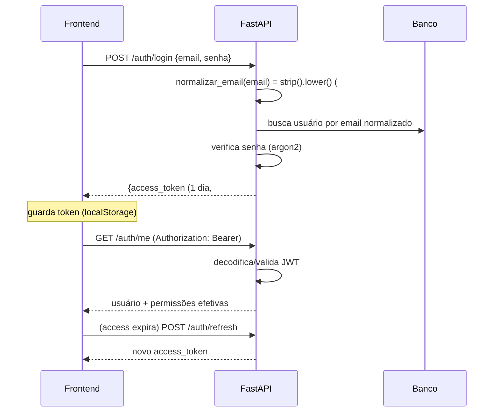
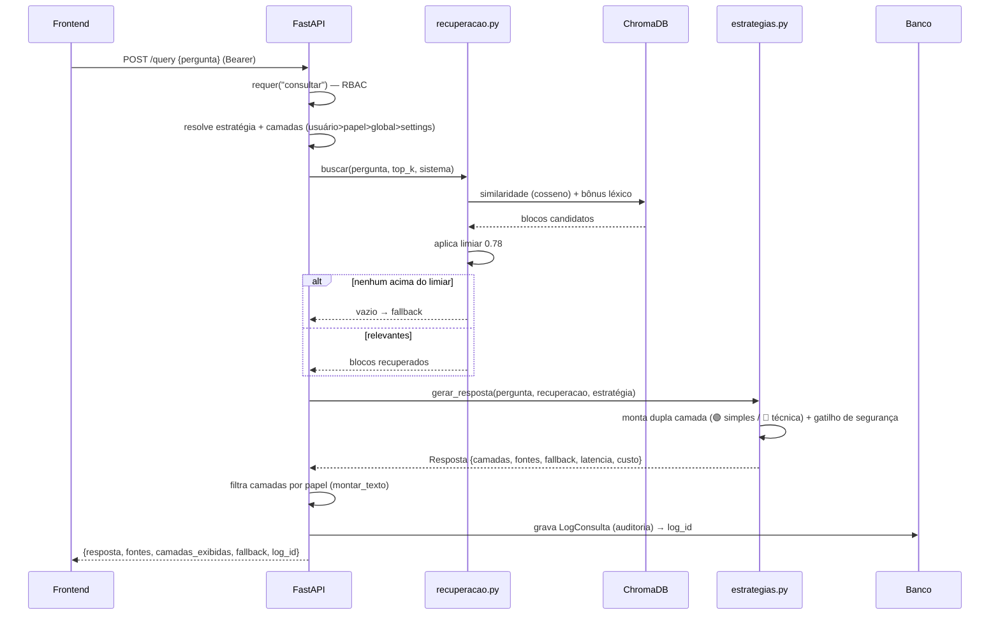
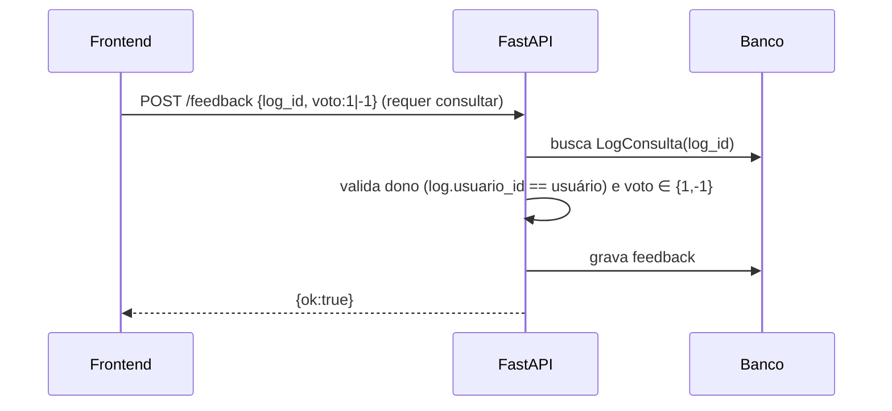
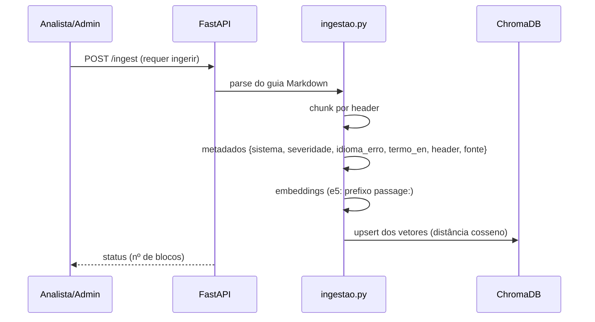
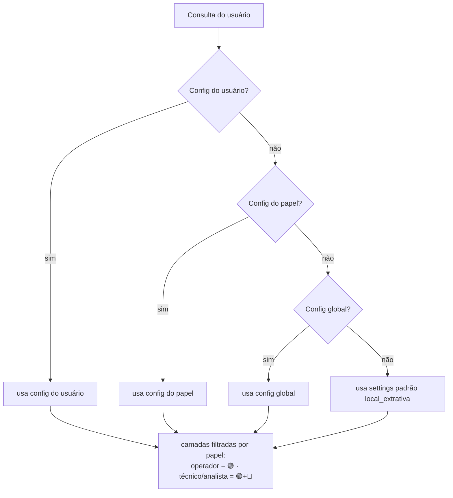
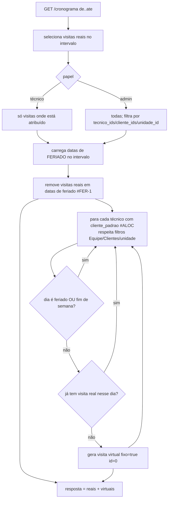
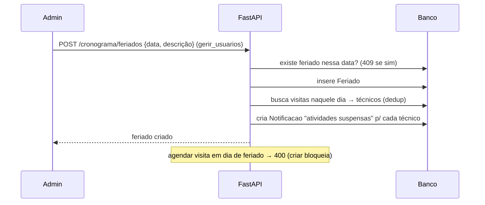
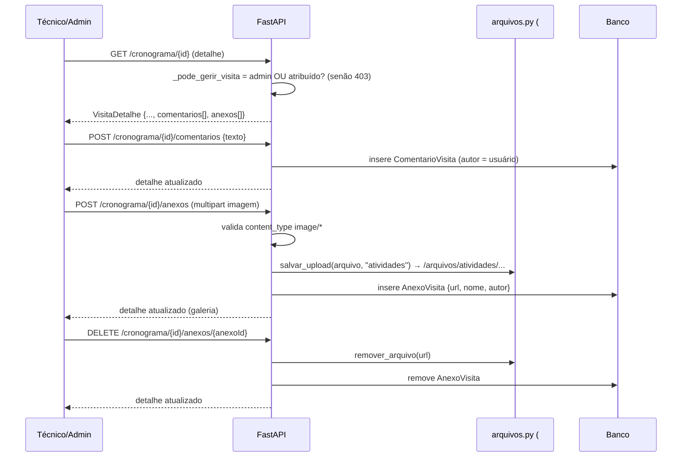

# Fluxos — RAG-Simplex

Diagramas de sequência dos fluxos principais, para **reproduzir o comportamento**
em qualquer stack. Complementa [`ARQUITETURA.md`](ARQUITETURA.md) e
[`MODELO_DADOS.md`](MODELO_DADOS.md).

## 1. Autenticação (JWT)



> **#FIX-EMAIL:** o e-mail é normalizado (`strip().lower()`) no **login** e na **criação**
> (API + CLI admin); existentes normalizados pela migração Alembic `5c77258e6fc6`. Login é
> **case-insensitive**. **#FIX-TOKEN:** access token dura **1 dia** (`access_token_expira_min=1440`).

## 2. Consulta `/query` (RAG completo)



## 3. Streaming `/query/stream` (NDJSON)

```mermaid
sequenceDiagram
  participant U as Frontend
  participant API as FastAPI
  U->>API: POST /query/stream {pergunta} (requer consultar_stream)
  API->>API: mesma resolução + recuperação + geração + log (item 2)
  API-->>U: linha 1 — {tipo:"meta", log_id, fallback, camadas, fontes}
  loop pedaços do texto
    API-->>U: {tipo:"delta", texto:"..."}
  end
  Note over U: ReadableStream lê linha a linha; renderiza markdown incremental
```
> Operador (sem `consultar_stream`) → o frontend usa `/query` (não-stream).

## 4. Feedback 👍/👎



## 5. Ingestão (indexação da base)



## 6. Resolução de estratégia e camadas (precedência)



## 7. Cronograma — listar visitas (#ALOC virtuais + #FER-1)

`GET /cronograma?de&ate&tecnico_ids&cliente_ids&unidade_id` monta a visão do mês combinando
**visitas reais** e **alocações fixas virtuais** (#ALOC), suprimindo **feriados** (#FER-1).
Filtros multi: **Equipe** (`tecnico_ids`) e **Clientes** (`cliente_ids`).



## 8. Ordem de Serviço — criar / editar (#OS, D-025)

A **O.S. é a própria visita** (D-025). `POST /cronograma` cria; `PATCH /cronograma/{id}` edita.
Campos além do básico (`data`, `titulo`, `status`): **`tipo`** (manutenção
`preventiva|corretiva|avulsa`), **`equipamento_id`**, **`falha_id`** (catálogo) e os **12 campos
do documento de corretiva** (`especialidade`, `requisitante`, `data_solicitacao`, `centro_custo`,
`numero_os`, `reserva_material`, `material_utilizado`, `endereco`, `setor`, `prioridade`,
`data_execucao`, `acao_aplicada`). Regras aplicadas por `_aplicar_os`.

```mermaid
sequenceDiagram
  participant Admin as Admin (gerir_usuarios)
  participant API as FastAPI (cronograma.py)
  participant DB as Banco
  Admin->>API: POST /cronograma {data, titulo, tipo, cliente_id,<br/>usuario_ids[], equipamento_id?, falha_id?, campos-doc?}
  API->>DB: dia é feriado? → 400 se sim (#FER-1)
  Note over API: usuario_ids vazio →<br/>técnicos = fixos do cliente (cliente_padrao_id, #ALOC)
  API->>API: sem técnicos e sem cliente → 400
  API->>API: _aplicar_os: tipo ∉ {preventiva,corretiva,avulsa} → 400
  API->>DB: equipamento_id informado inexistente → 404
  API->>DB: grava Visita + vínculo N:N de técnicos
  API->>API: status=concluida E equipamento? → equipamento.ultima_manutencao = data (#MAP-4)
  API->>DB: cria Notificacao "Nova O.S.: {titulo}" p/ cada técnico (ref_id = visita, #NOTIF-LINK)
  API-->>Admin: 201 VisitaResumo {tipo, equipamento_tag, falha_nome, campos-doc}
  Admin->>API: PATCH /cronograma/{id} {tipo?, equipamento_id?, falha_id?, campos-doc?, status?}
  Note over API: admin edita tudo (_aplicar_os); técnico só status+observacoes.<br/>Só os campos em model_fields_set são tocados (Pydantic v2)
  API->>API: concluir aqui também grava ultima_manutencao
  API-->>Admin: 200 VisitaResumo atualizado
```

**Histórico do equipamento** (#MAP-4): `GET /cronograma/equipamento/{id}` devolve as O.S. daquele
equipamento (ordenadas por data desc). RBAC: admin vê tudo; técnico só se o **cliente do
equipamento** estiver entre os seus (`clientes_rel`) — senão **403** (404 se o equipamento não existe).

## 9. Cronograma — marcar feriado (#FER-1)



## 10. Atividade / O.S. — comentar e anexar imagem (#ATV-1)



## Invariantes refletidas nos fluxos
- **RBAC** checado na borda (`requer(permissao)`) antes de qualquer lógica.
- **Limiar 0.78**: abaixo → fallback (nunca improvisar procedimento).
- **Ancoragem total**: resposta só com blocos recuperados.
- **Auditoria** sempre grava o `LogConsulta` (com `log_id` devolvido para o feedback).
- **Latência < 3s**: sem extended thinking na geração.
