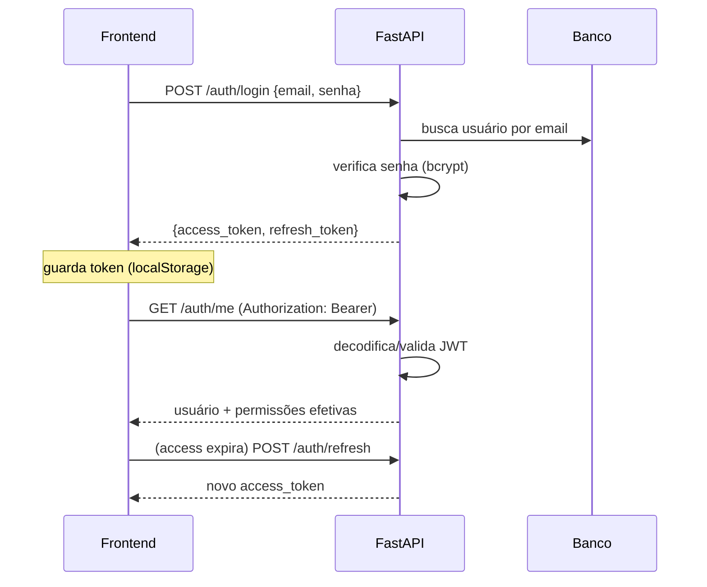
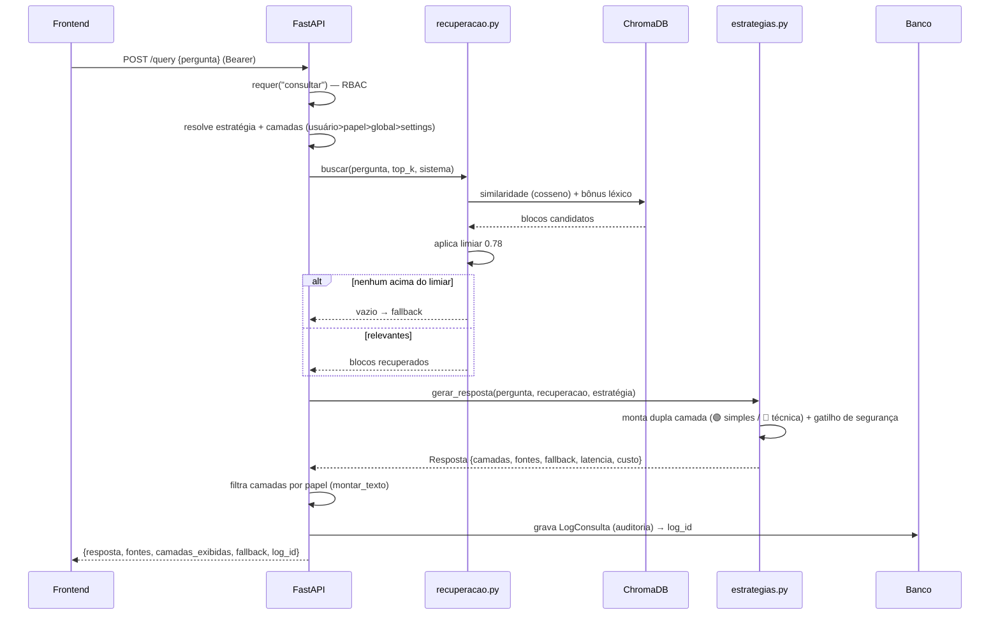
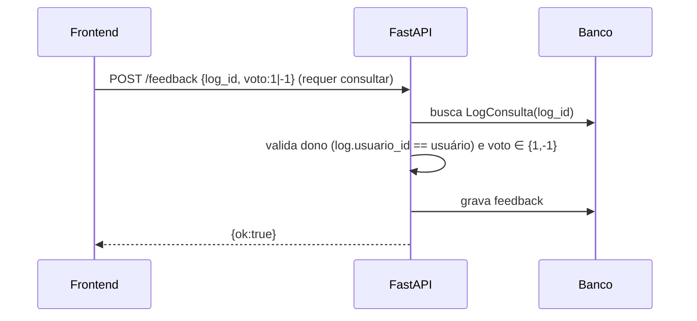
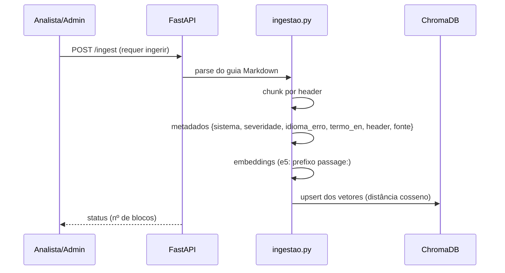
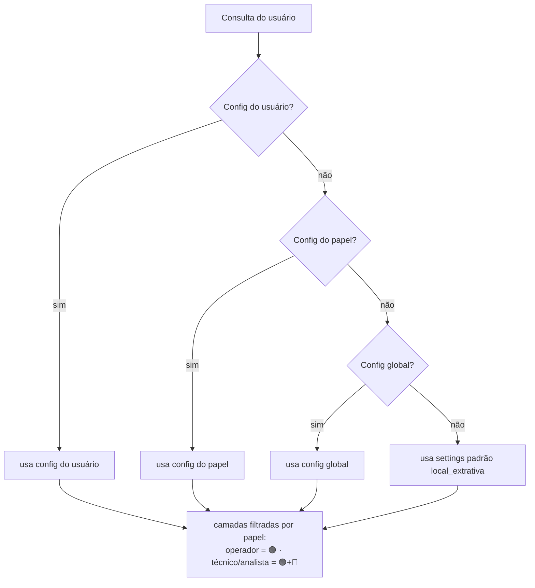

# Fluxos — RAG-Simplex

Diagramas de sequência dos fluxos principais, para **reproduzir o comportamento**
em qualquer stack. Complementa [`ARQUITETURA.md`](ARQUITETURA.md) e
[`MODELO_DADOS.md`](MODELO_DADOS.md).

## 1. Autenticação (JWT)



## 2. Consulta `/query` (RAG completo)



## 3. Streaming `/query/stream` (NDJSON)

```mermaid
sequenceDiagram
  participant U as Frontend
  participant API as FastAPI
  U->>API: POST /query/stream {pergunta} (requer consultar_stream)
  API->>API: mesma resolução + recuperação + geração + log (item 2)
  API-->>U: linha 1 — {tipo:"meta", log_id, fallback, camadas, fontes}
  loop pedaços do texto
    API-->>U: {tipo:"delta", texto:"..."}
  end
  Note over U: ReadableStream lê linha a linha; renderiza markdown incremental
```
> Operador (sem `consultar_stream`) → o frontend usa `/query` (não-stream).

## 4. Feedback 👍/👎



## 5. Ingestão (indexação da base)



## 6. Resolução de estratégia e camadas (precedência)



## Invariantes refletidas nos fluxos
- **RBAC** checado na borda (`requer(permissao)`) antes de qualquer lógica.
- **Limiar 0.78**: abaixo → fallback (nunca improvisar procedimento).
- **Ancoragem total**: resposta só com blocos recuperados.
- **Auditoria** sempre grava o `LogConsulta` (com `log_id` devolvido para o feedback).
- **Latência < 3s**: sem extended thinking na geração.
