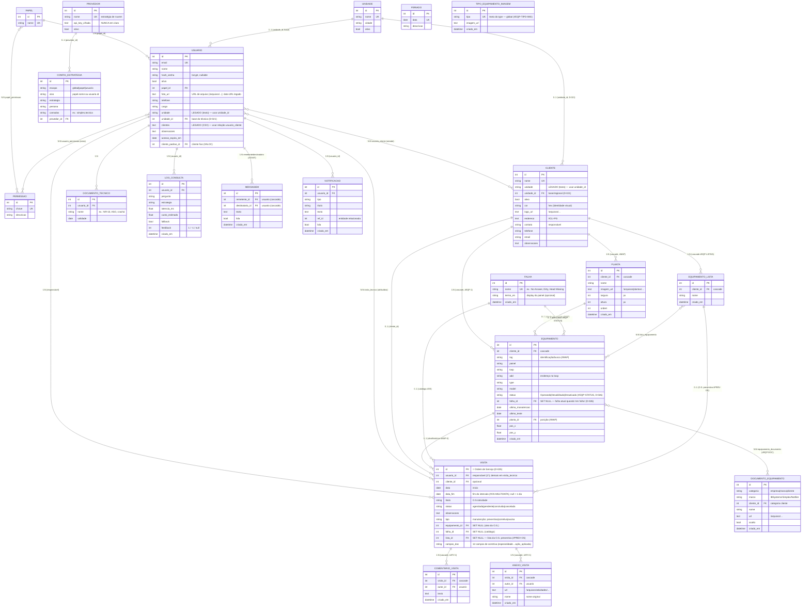

# Modelo de Dados — RAG-Simplex

Esquema relacional (SQLAlchemy 2.0 → SQLite por padrão; portável a Postgres/MySQL).
Objetivo: permitir **recriar o schema com exatidão** em qualquer stack. Código-fonte:
[`app/modelos.py`](../app/modelos.py). Migrações: micro-migração em
[`app/db.py`](../app/db.py) (adição de coluna nullable) — ver backlog para Alembic.

## Diagrama (ER)

## Entidades

### Permissao / Papel (RBAC)
Permissões atômicas (`chave` única) agrupadas em papéis via `papel_permissao` (N:N).
Papéis e permissões são **semeados** (idempotente) por [`app/seed.py`](../app/seed.py).

### Usuario
Conta de técnico/operador. `papel_id` define o papel; `usuario_permissao` concede
**permissões extra** sem trocar o papel. Campos de perfil/acesso (foto, telefone,
cargo, unidade, clientes, observações, `acesso_expira_em`) adicionados na Fase 8.
> `clientes` é **CSV provisório**; o plano prevê trocar por relação N:N com `CLIENTE`
> (ver [`projeto/BACKLOG.md`](projeto/BACKLOG.md) §2, Etapa 1) — evitar acoplar muito a ele.

### Cliente
Cliente atendido (prédio/condomínio/instalação) com `unidade_id` (base/regional, D-021).
Técnicos são associados a clientes via `usuario_cliente` (N:N) — define **acesso** e o
**cronograma por local**. Substitui o campo legado `Usuario.clientes` (CSV), que permanece
na tabela mas não é mais usado pela API.

### Cliente — cadastro completo (#CLI-PG)
Além de `nome/unidade_id/cor/logo_url`, o cliente tem **página própria** com `endereco`,
`contato` (responsável), `telefone`, `email`, `observacoes`. `GET /admin/clientes/{id}`
devolve o detalhe (campos + `equipamentos[]`). UI em `pages/ClienteAdmin.tsx`.

### Unidade (D-021)
Base/regional operacional (`nome` único, `cidade`, `ativo`). Promove o antigo texto livre
`unidade` (em `Usuario`/`Cliente`) a **entidade**, para a **"visão por unidade"** do
cronograma ter filtro robusto (sem sofrer com variação de digitação). Tanto técnicos
(`Usuario.unidade_id`, base) quanto clientes (`Cliente.unidade_id`) referenciam a unidade.
O filtro `GET /cronograma?unidade_id=` mostra só as visitas cujo **cliente** pertence à
unidade. O texto livre legado permanece como fallback de exibição (sem migração obrigatória).

### Visita (cronograma)
**= Ordem de Serviço (D-025).** Atividade/O.S. agendada num dia (`data`), opcionalmente num
cliente (`cliente_id`), com `status`. **Vários técnicos** podem ser atribuídos (N:N
`visita_tecnico`, #CR8); sem técnicos informados na criação, usa os **fixos do cliente**
(#ALOC). `usuario_id` é o responsável (1º) por compatibilidade. Técnico vê visitas em que está
atribuído; admin vê todas. Notificação ao criar ("Nova O.S.") vai para **todos** os atribuídos
e linka à O.S. **Feriado** (#FER-1): no dia de feriado o `listar` suprime visitas e alocações
fixas. Ver [`projeto/specs/spec-etapa3-cronograma.md`](projeto/specs/spec-etapa3-cronograma.md).

**Campos de O.S.** (D-025): `tipo` ∈ manutenção **preventiva/corretiva/avulsa**;
`equipamento_id` (alvo, SET NULL → alimenta histórico #MAP-4); `falha_id` (catálogo `Falha`,
SET NULL); e, para corretiva, os **12 campos do documento**: especialidade, requisitante,
data_solicitacao, centro_custo, numero_os, reserva_material, material_utilizado, endereco,
setor, prioridade, data_execucao, acao_aplicada. **Concluir** com data grava
`equipamento.ultima_manutencao`. Histórico por equipamento: `GET /cronograma/equipamento/{id}`.

### Falha (catálogo, #OS)
Catálogo cadastrável de **falhas do painel** (`nome` único; `termo_en` = display em inglês,
ex.: `HEAD MISSING`). 1 falha por O.S. (`Visita.falha_id`). CRUD em `/admin/falhas`
(`gerir_usuarios`). Ver [`projeto/specs/spec-os-ordem-servico.md`](projeto/specs/spec-os-ordem-servico.md).

### Planta + Equipamento no mapa (#MAP)
**Planta** = uma imagem (PNG) de projeto do cliente; o admin sobe um **PDF** e o servidor
converte **cada página em uma planta** (PyMuPDF, `settings.planta_dpi`). O **Equipamento**
ganhou: `tag` (identificação/busca, ex.: `N2-L23-DF-003`), `status`, `ultima_manutencao`,
`ultimo_teste`, e a **posição** (`planta_id` + `pos_x`/`pos_y` em px) — as *coordenadas-map*
usadas para localizá-lo no projeto. O histórico detalhado de manutenção virá da futura
**Ordem de Serviço (O.S.)**. Ver [`projeto/specs/spec-map-mapa-dispositivos.md`](projeto/specs/spec-map-mapa-dispositivos.md).

### Equipamento (#EQP-1)
Dispositivo do painel de incêndio de um **cliente** (`cliente_id`, cascade), importado por
**CSV**. Colunas: `painel`, `loop`, `add` (endereço no loop), `type`, `model`. Fases
seguintes (adiadas): `ultima_manutencao`/`ultimo_teste` e histórico do painel. A UI (lista +
upload) vive na **página do cliente** (#CLI-PG) e na sidebar "Equipamentos" (#EQP-2).
Cada dispositivo tem **página própria** (#EQP-PAGINA): dados + O.S. + documentos da biblioteca.
Ver [`projeto/specs/spec-eqp1-equipamento-csv.md`](projeto/specs/spec-eqp1-equipamento-csv.md).

### EquipamentoLista (listas nomeadas, #EQP-LISTAS)
Lista **nomeada** de equipamentos de um cliente (`nome`, `cliente_id` cascade) com N:N
`lista_equipamento`. Na lista de equipamentos aparecem como **chips** no topo (filtram a
tabela). Servem de base para **gerar o documento de manutenção preventiva** (#PREV-DOC:
`GET /admin/listas/{id}/documento-preventiva` → relatório imprimível). CRUD em
`/admin/clientes/{id}/listas` + `/admin/listas/{id}` (`gerir_usuarios`); ids de outro cliente
são ignorados na gravação.

### ComentarioVisita / AnexoVisita (página da atividade, #ATV-1)
A atividade (`Visita`) tem uma **página própria** com **comentários** e **anexos de
imagem** (ambos `cascade` na visita). `ComentarioVisita`: `autor_id`, `texto`, `criado_em`.
`AnexoVisita`: imagem em `/arquivos/atividades/` (`url`, `nome`, `autor_id`, `criado_em`).
Acesso (ver/comentar/anexar/mudar status): **técnico atribuído ou admin**. Reusa #FILES.
Ver [`projeto/specs/spec-atv1-pagina-atividade.md`](projeto/specs/spec-atv1-pagina-atividade.md).

### Feriado / Notificacao
`Feriado` (global): data única + descrição; destaca o dia no cronograma.
`Notificacao`: mensagem para um usuário (`lida` controla o badge do sino); criada,
p.ex., ao agendar uma atividade para o técnico. Cada usuário vê só as próprias.

### DocumentoTecnico
Documento exigido do técnico (NR-10, ASO, crachá de cliente) com `validade`. O painel
ADM destaca documentos **vencidos/vencendo** (≤ 30 dias) para renovação.

### LogConsulta (auditoria)
Uma linha por consulta (segurança de vida → rastreabilidade, PRD §6.2). `feedback`
guarda o voto 👍/👎 (1/-1/null). Não armazena a resposta nem a chave do provedor.

### ConfigEstrategia (precedência)
Define qual estratégia/persona/camadas usar por **escopo**: `usuario` > `papel` >
`global` > `settings` (config.py/.env). `alvo` identifica o papel (nome) ou usuário (id).

### Provedor
Provedor de LLM de nuvem (Fase 10). `api_key_cifrada` guarda a chave **cifrada**
(`app/cripto.py`); a API só devolve versão **mascarada**.

## Regras e invariantes

- IDs inteiros autoincrementais (PK). Em outra stack, manter unicidade de
  `usuario.email`, `papel.nome`, `permissao.chave`, `provedor.nome`.
- `DocumentoTecnico.usuario_id` com **ON DELETE CASCADE**.
- Datas (`validade`, `acesso_expira_em`) sem fuso (date); `criado_em` em UTC.
- **Nunca** persistir chave de provedor em claro; **nunca** persistir a resposta gerada.

## Relacionada
[`ARQUITETURA.md`](ARQUITETURA.md) · [`FLUXOS.md`](FLUXOS.md) · [`TECNOLOGIAS.md`](TECNOLOGIAS.md)
