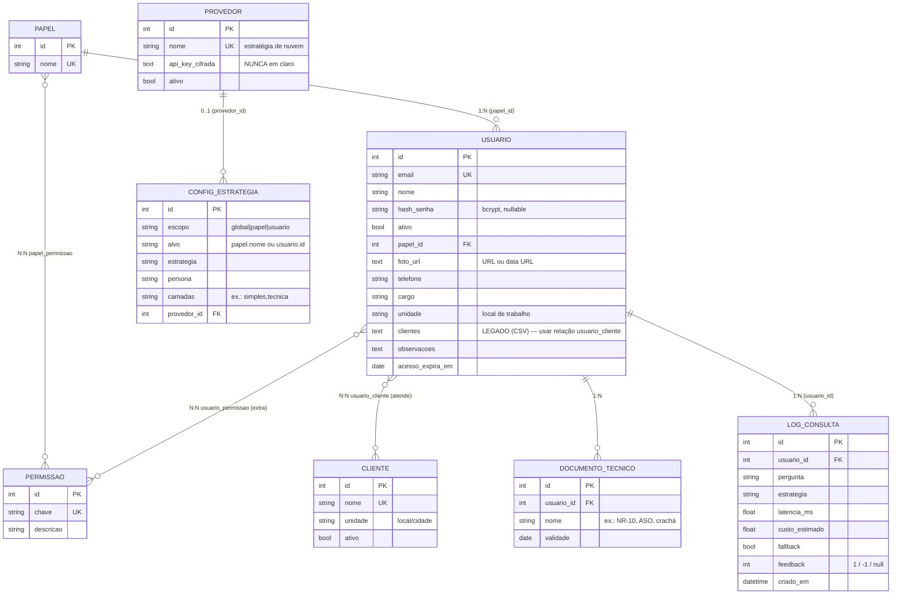

# Modelo de Dados — RAG-Simplex

Esquema relacional (SQLAlchemy 2.0 → SQLite por padrão; portável a Postgres/MySQL).
Objetivo: permitir **recriar o schema com exatidão** em qualquer stack. Código-fonte:
[`app/modelos.py`](../app/modelos.py). Migrações: micro-migração em
[`app/db.py`](../app/db.py) (adição de coluna nullable) — ver backlog para Alembic.

## Diagrama (ER)

## Entidades

### Permissao / Papel (RBAC)
Permissões atômicas (`chave` única) agrupadas em papéis via `papel_permissao` (N:N).
Papéis e permissões são **semeados** (idempotente) por [`app/seed.py`](../app/seed.py).

### Usuario
Conta de técnico/operador. `papel_id` define o papel; `usuario_permissao` concede
**permissões extra** sem trocar o papel. Campos de perfil/acesso (foto, telefone,
cargo, unidade, clientes, observações, `acesso_expira_em`) adicionados na Fase 8.
> `clientes` é **CSV provisório**; o plano prevê trocar por relação N:N com `CLIENTE`
> (ver [`projeto/BACKLOG.md`](projeto/BACKLOG.md) §2, Etapa 1) — evitar acoplar muito a ele.

### Cliente
Cliente atendido (prédio/condomínio/instalação) com `unidade` (local). Técnicos são
associados a clientes via `usuario_cliente` (N:N) — define **acesso** e o **cronograma
por local**. Substitui o campo legado `Usuario.clientes` (CSV), que permanece na tabela
mas não é mais usado pela API.

### DocumentoTecnico
Documento exigido do técnico (NR-10, ASO, crachá de cliente) com `validade`. O painel
ADM destaca documentos **vencidos/vencendo** (≤ 30 dias) para renovação.

### LogConsulta (auditoria)
Uma linha por consulta (segurança de vida → rastreabilidade, PRD §6.2). `feedback`
guarda o voto 👍/👎 (1/-1/null). Não armazena a resposta nem a chave do provedor.

### ConfigEstrategia (precedência)
Define qual estratégia/persona/camadas usar por **escopo**: `usuario` > `papel` >
`global` > `settings` (config.py/.env). `alvo` identifica o papel (nome) ou usuário (id).

### Provedor
Provedor de LLM de nuvem (Fase 10). `api_key_cifrada` guarda a chave **cifrada**
(`app/cripto.py`); a API só devolve versão **mascarada**.

## Regras e invariantes

- IDs inteiros autoincrementais (PK). Em outra stack, manter unicidade de
  `usuario.email`, `papel.nome`, `permissao.chave`, `provedor.nome`.
- `DocumentoTecnico.usuario_id` com **ON DELETE CASCADE**.
- Datas (`validade`, `acesso_expira_em`) sem fuso (date); `criado_em` em UTC.
- **Nunca** persistir chave de provedor em claro; **nunca** persistir a resposta gerada.

## Relacionada
[`ARQUITETURA.md`](ARQUITETURA.md) · [`FLUXOS.md`](FLUXOS.md) · [`TECNOLOGIAS.md`](TECNOLOGIAS.md)
