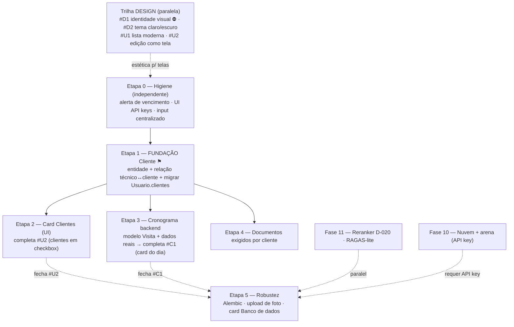

# Planejamento Mestre — RAG-Simplex

Visão única de **onde estamos** e **para onde vamos**. Consolida o status das fases
([`ROADMAP.md`](ROADMAP.md)) e o backlog/sequência ([`BACKLOG.md`](BACKLOG.md)).
Para o que já existe, ver [`../ARQUITETURA.md`](../ARQUITETURA.md).

**Atualizado:** 2026-06-24 · **Branch:** `feat/fase-7-frontend` · **Backend:** 61 testes ✅

---

## 1. Snapshot — onde estamos

**Fases 0–9 concluídas** (tudo **sem API key, sem custo**). O produto já é usável de
ponta a ponta: o técnico pergunta, recebe resposta ancorada em dupla camada (com
streaming, citações e feedback), e o admin gerencia usuários/acessos.

| Bloco | Estado |
| --- | --- |
| Núcleo RAG (ingestão, recuperação 0.78, extrativo) | ✅ |
| Plataforma (auth JWT, RBAC, persistência, migração) | ✅ |
| Chat (streaming, citações, feedback, histórico, responsivo) | ✅ |
| Painel ADM em cards (usuários+perfil+documentos, auditoria) | ✅ |
| **Cronograma real (visitas) + card do dia por papel** | ✅ (Etapa 3 / #C1) |
| **Cronograma — otimizações (#CR1–#CR5)** | ✅ (grade do mês, avatares, fim de semana, feriados, notificações) |
| **Entidade Cliente (N:N técnico↔cliente) + card Clientes CRUD** | ✅ (Etapa 1) |
| Cards ADM: API keys / Banco de dados | ⬜ placeholder |
| **Identidade visual (IBSystems) + tema claro/escuro** | ✅ (logo: falta o arquivo) |
| **Logo natural (SVG/sem fundo/maior) + Home ao clicar no logo** | ⬜ (#D3 ⛔ asset · #HOME) |
| **Redesign: lista de usuários (foto+cargo) e edição como tela própria** | ⬜ |
| **Cronograma: card do dia (visão ADM/técnico)** | ⬜ |
| Fase 10 (nuvem + arena) | ⬜ requer API key |
| Fase 11 (reranker, RAGAS-lite, Alembic) | ⬜ |

## 2. Status das fases

| Fase | Tema | Status |
| --- | --- | --- |
| 0–2 | Pipeline RAG · extrativo · dupla camada | ✅ |
| 3 | Persistência (ORM, seed, cripto) | ✅ |
| 4 | Autenticação (JWT) | ✅ |
| 5 | RBAC (papéis/permissões/camadas) | ✅ |
| 6 | Painel ADM (backend) | ✅ |
| 7 | Frontend base + Docker | ✅ |
| 8 | Chat (streaming, citações, feedback, histórico, layout, perfil) | ✅ |
| 9 | Painel ADM (frontend) | ✅ |
| 10 | Estratégias de nuvem + arena | ⬜ (API key) |
| 11 | Hardening (reranker D-020, RAGAS-lite, Alembic) | ⬜ |

## 3. Plano de execução (sequência sem retrabalho)

Regra: **fundações de dados compartilhadas antes das telas que dependem delas.**
A entidade **`Cliente`** é dependência de 4 frentes → vem antes.

### Otimizações do Cronograma (em andamento — detalhe em BACKLOG §C)
`Avatar` reutilizável → **#CR2** (miniatura do dia) e **#CR5** (onde cada um está) →
**#CR1** (grade só do mês) e **#CR3** (fim de semana/feriado) → **#CR4** (notificações,
fundação genérica). Ordem pensada para não retrabalhar.

### Marcos (milestones)
- **M0 — Identidade & tema:** trilha Design (#D1 paleta da empresa, #D2 claro/escuro, #U1/#U2 redesign).
- **M1 — Fundação de clientes:** Etapa 1 (entidade + relação + migração + specs/testes/docs).
- **M2 — Gestão operacional:** Etapas 2–3 (card Clientes + Cronograma real + cards do dia).
- **M3 — Robustez:** Etapa 5 (Alembic, storage de foto, banco de dados).
- **M4 — Inteligência avançada:** Fase 11 (reranker/avaliação) e, com chave, Fase 10 (nuvem).

## 4. Dependências e riscos

| Item | Depende de | Risco se invertido |
| --- | --- | --- |
| #D1 identidade visual | **paleta/logo da empresa** (⛔ pendente) | retrabalho de cores se feito a olho |
| #U2 clientes em checkbox | entidade Cliente (Etapa 1) | refazer o seletor de clientes |
| #C1 card do dia (dados reais) | Cronograma backend (Etapa 3) | preencher com dados falsos 2× |
| Card Clientes | entidade Cliente | refazer UI + migrar dados 2× |
| Cronograma real | Cliente/Unidade | eventos sem vínculo correto |
| `Usuario.clientes` → relação | entidade Cliente | acoplamento ao CSV provisório |
| Alembic | schema estável | migrações que nascem e morrem |
| Fase 10 (nuvem) | API key + decisão D-006 | custo; bloqueia se feito cedo |

## 5. Definição de pronto (DoD)

Cada entrega só fecha com: código + **testes** (backend) / `tsc` (frontend) + **spec**
(se módulo novo) + **docs atualizadas** (`ARQUITETURA`/`MODELO_DADOS`/`FLUXOS` conforme
o caso) + entrada no [`LOG.md`](LOG.md) + atualização deste arquivo e do [`BACKLOG.md`](BACKLOG.md).

## 6. Como retomar numa sessão nova
1. Ler este `PLANEJAMENTO.md` (onde estamos) e o [`ESTADO_ATUAL.md`](ESTADO_ATUAL.md).
2. Pegar o próximo item no [`BACKLOG.md`](BACKLOG.md) respeitando a sequência da §3.
3. Consultar [`../ARQUITETURA.md`](../ARQUITETURA.md)/[`../MODELO_DADOS.md`](../MODELO_DADOS.md)/[`../FLUXOS.md`](../FLUXOS.md) para o desenho.
4. Implementar com testes + docs; registrar no `LOG.md` e atualizar este plano.
